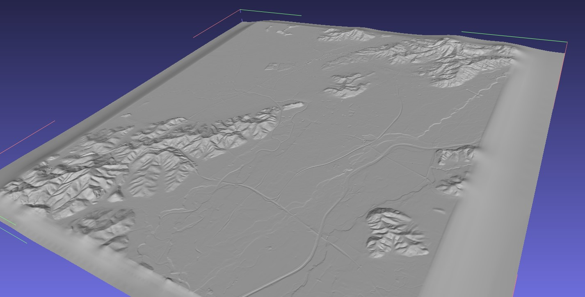
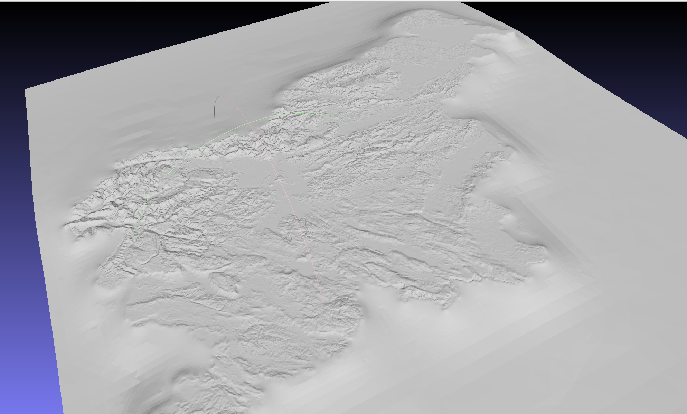

# ⚡ godmv - hitro procesiranje DMV podatkov

DMV (digitalni model višin) podatki so dostopni na GURS. Več info o tem, kaj to je: https://www.e-prostor.gov.si/podrocja/drzavni-topografski-sistem/digitalni-modeli-visin/?acitem=1220-1221

Teh podatkov je precej. Razdeljeni so po >3000 tekstovnih datotekah. Vse datoteke skupaj so velike ~16GB, kar pomeni približno ~800.000.000 vrstic. Problem se pojavi, ko želiš izvoziti podatke le za določen del Slovenije.

- Prvič ne veš, v kateri datoteki se podatki za ta del nahajajo
- Drugič, teh podatkov je preveč, da bi delal na vseh naenkrat

To je program, ki hitro obdela vse datoteke/podatke (na mojem PCju traja ~20s) in zgenerira eno .xyz datoteko, ki vsebuje samo podatke za izbrano območje. Poleg tega ima program tudi možnost avtomatskega prenosa vseh podatkov iz GURSa (to določimo z `--download=True`).

Poženi:

```bash
go build
```

Zaženi program:

```bash
./godmv --pt1="454599.447438 108039.344481" --pt2="470830.101264 93983.086080" --download=true
```

Območje, ki ga želimo izvoziti, definiramo z dvema parametroma - **pt1** in **pt2**

- **pt1** - leva zgornja točka območja
- **pt2** - desna spodnja točka območja

Vrednosti pt1 in pt2 lahko najdemo [TUKAJ](https://epsg.io/map#srs=3794-15976&x=462018.511629&y=101705.292889&z=3&reproject=1&layer=streets) (epsg.io)


Na koncu se izvozijo vse točke znotraj pravokotnika, ki je določen s pt1 in pt2.

```txt
pt1
X--------------
|             |
|             |
--------------X
              pt2
```

Še 3D pogled znotraj Meshlab-a




---

Help?

```bash
./godmv --help
```
